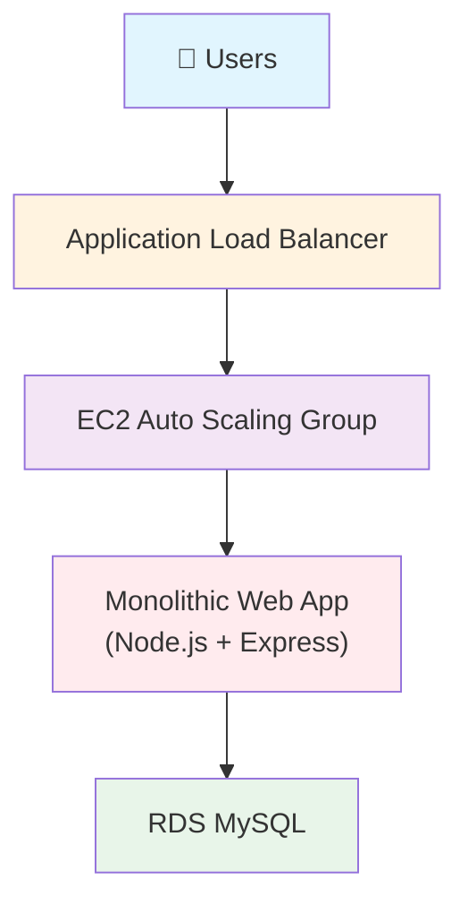
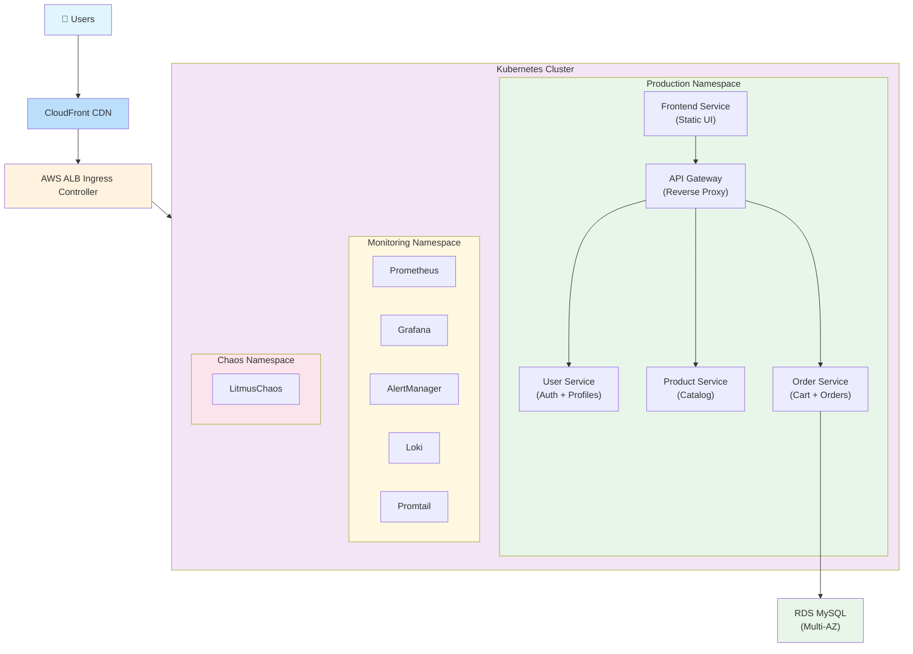
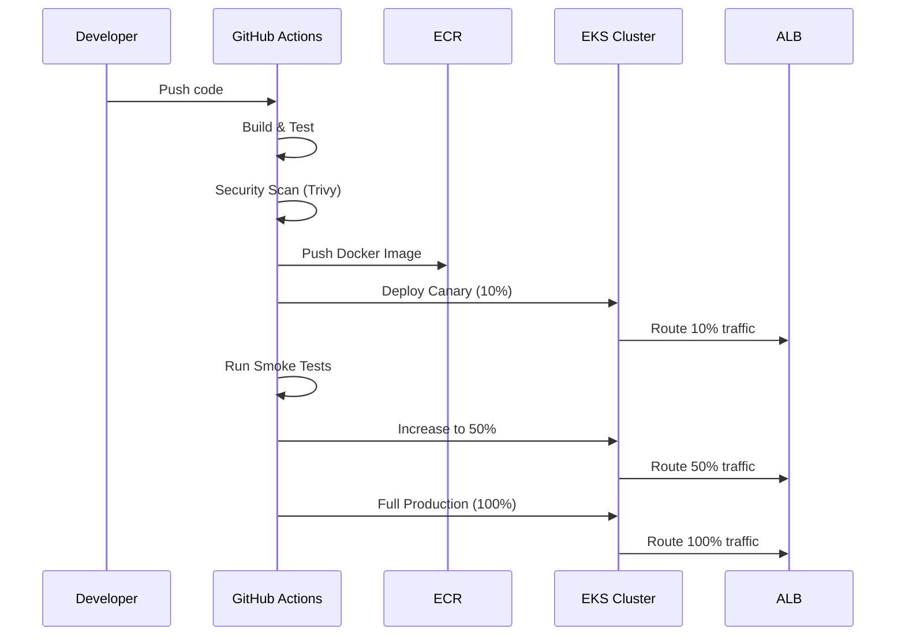
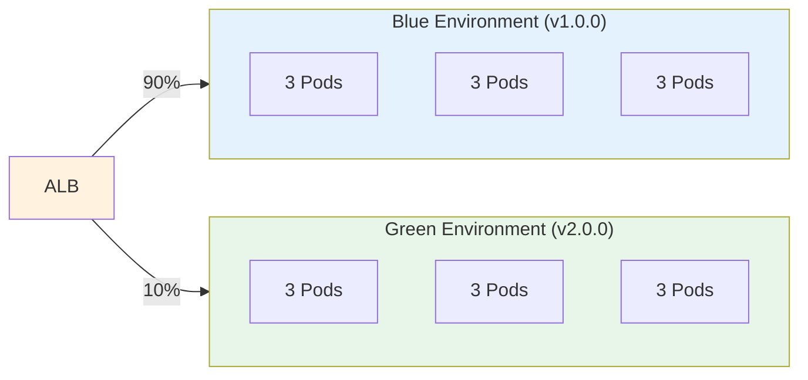
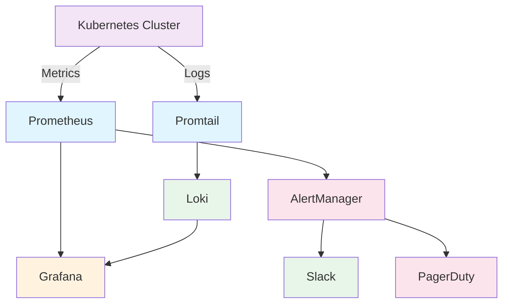
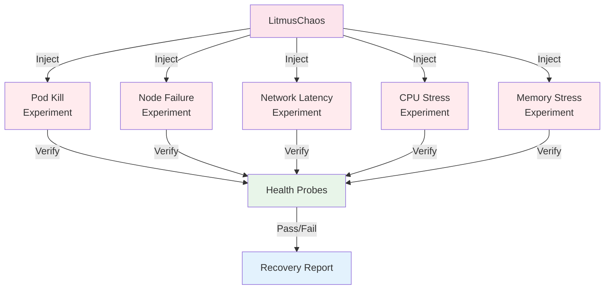
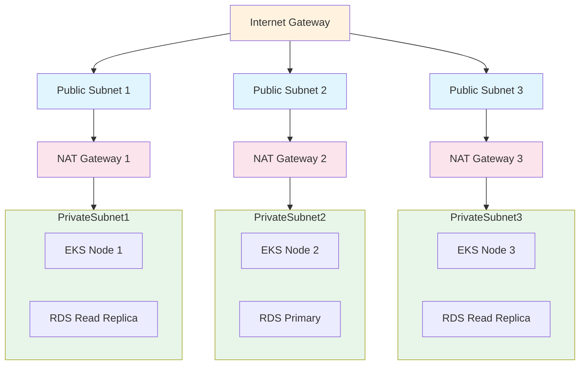

# Architecture Diagrams

## Legacy Architecture

## Modern Architecture

## Migration Flow

## Blue-Green Deployment

## CI/CD Pipeline

```mermaid
graph LR
    Build["Build"] --> Test["Test"]
    Test --> Security["Security Scan"]
    Security --> Push["Push Image"]
    Push --> Canary["Deploy Canary"]
    Canary --> Smoke["Smoke Tests"]
    Smoke --> Ramp["Increase Traffic"]
    Ramp --> Full["Full Production"]
    
    style Build fill:#e1f5fe
    style Test fill:#fff3e0
    style Security fill:#fce4ec
    style Push fill:#e8f5e9
    style Canary fill:#f3e5f5
    style Smoke fill:#fff8e1
    style Ramp fill:#e0f7fa
    style Full fill:#e8f5e9
```

## Observability Stack

## Chaos Engineering

## Network Architecture

